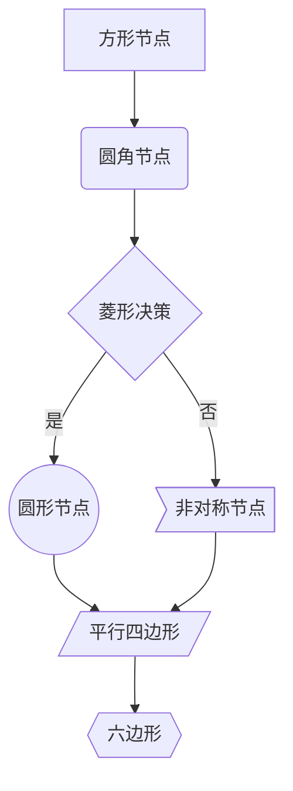
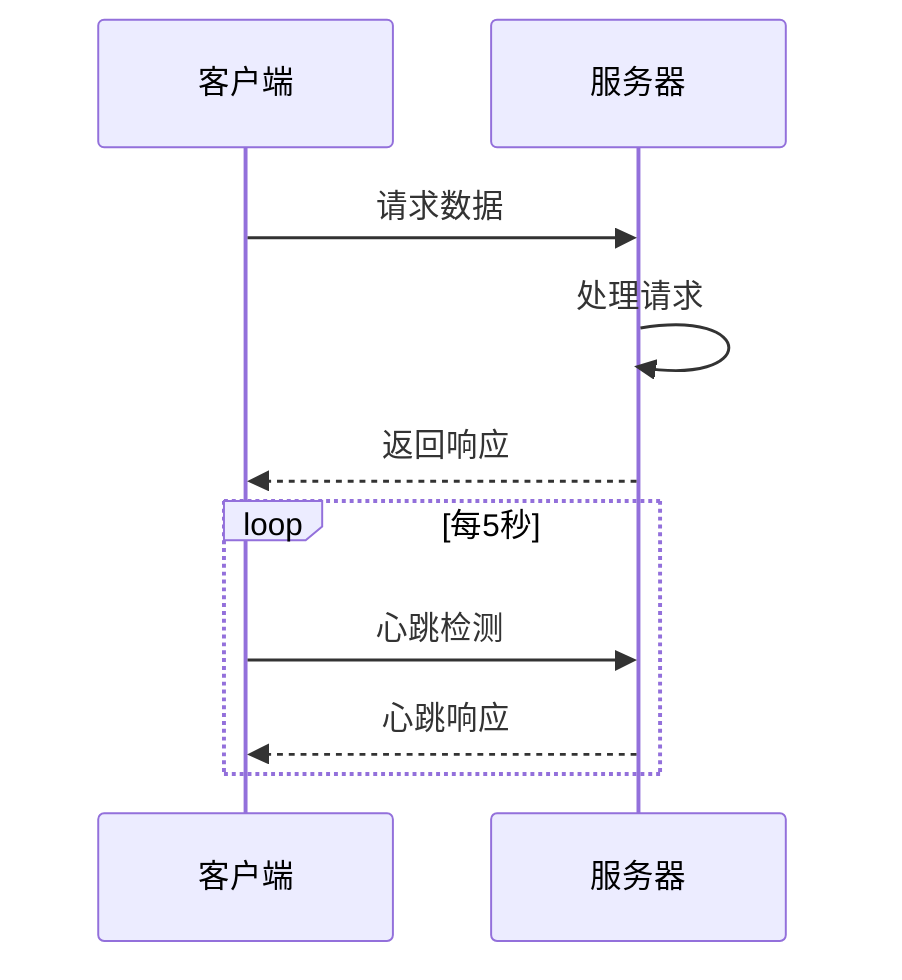
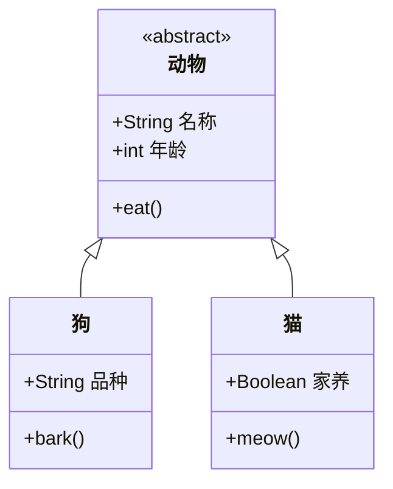
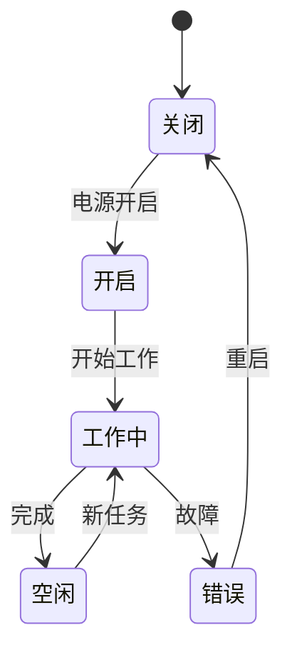
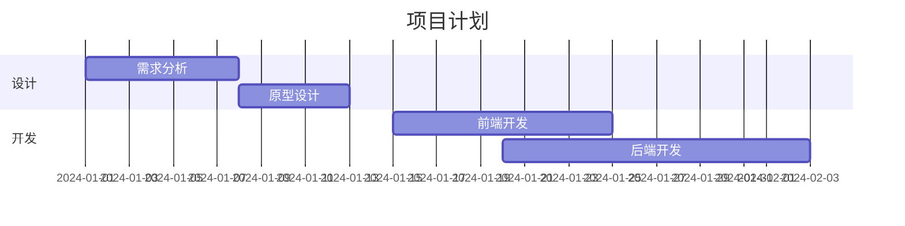
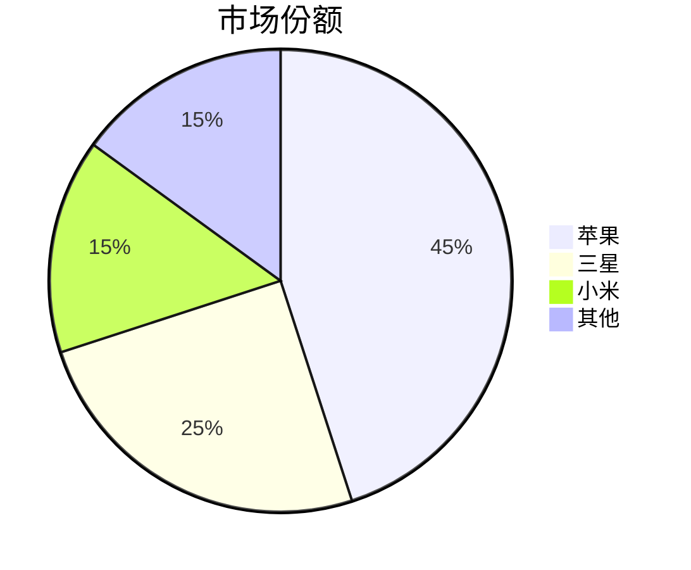
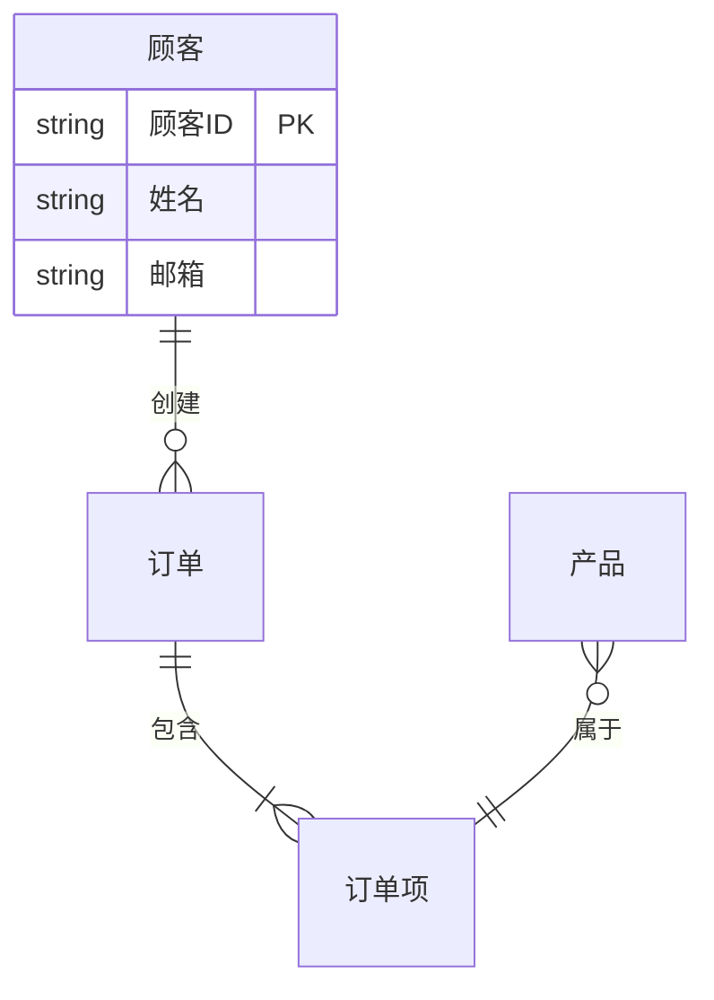

# 第3章 让VitePress1.6.x支持mermaid语法

## 1 安装依赖包

```bash
$ pnpm add -D vitepress-plugin-mermaid mermaid
```

## 2 调整`docs/.vitepress/config.mjs`

```js
import {MermaidMarkdown, MermaidPlugin} from "vitepress-plugin-mermaid";

export default defineConfig({
    markdown: {
        config(md) {
            md.use(MermaidMarkdown)
        }
    },

    vite: {
        plugins: [MermaidPlugin()],
        optimizeDeps: {
            include: ['mermaid'],
        },
        ssr: {
            noExternal: ['mermaid'],
        },
    },
})
```

## 3 重启

```bash
$ pnpm run docs:dev
```


## Mermaid 语法快速参考

### 1. 流程图 (Flowchart)

```tex [代码]
graph TD
    A[方形节点] --> B(圆角节点)
    B --> C{菱形决策}
    C -->|是| D((圆形节点))
    C -->|否| E>非对称节点]
    D --> F[/平行四边形/]
    E --> F
    F --> G{{六边形}}
```




### 2. 时序图 (Sequence Diagram)

```tex
sequenceDiagram
    participant A as 客户端
    participant B as 服务器
    A->>B: 请求数据
    B->>B: 处理请求
    B-->>A: 返回响应
    loop 每5秒
        A->>B: 心跳检测
        B-->>A: 心跳响应
    end
```



### 3. 类图 (Class Diagram)

```tex
classDiagram
    class 动物 {
        <<abstract>>
        +String 名称
        +int 年龄
        +eat()
    }
    
    class 狗 {
        +String 品种
        +bark()
    }
    
    class 猫 {
        +Boolean 家养
        +meow()
    }
    
    动物 <|-- 狗
    动物 <|-- 猫
```



### 4. 状态图 (State Diagram)

```tex
stateDiagram-v2
    [*] --> 关闭
    关闭 --> 开启: 电源开启
    开启 --> 工作中: 开始工作
    工作中 --> 空闲: 完成
    空闲 --> 工作中: 新任务
    工作中 --> 错误: 故障
    错误 --> 关闭: 重启
```



### 5. 甘特图 (Gantt Chart)

```tex
gantt
    title 项目计划
    dateFormat  YYYY-MM-DD
    section 设计
    需求分析     :a1, 2024-01-01, 7d
    原型设计     :after a1, 5d
    section 开发
    前端开发     :2024-01-15, 10d
    后端开发     :2024-01-20, 14d
```



### 6. 饼图 (Pie Chart)

```tex
pie
    title 市场份额
    "苹果" : 45
    "三星" : 25
    "小米" : 15
    "其他" : 15
```



### 7. 实体关系图 (ER Diagram)

```tex
erDiagram
    顾客 ||--o{ 订单 : "创建"
    订单 ||--|{ 订单项 : "包含"
    产品 }o--|| 订单项 : "属于"
    
    顾客 {
        string 顾客ID PK
        string 姓名
        string 邮箱
    }
```

