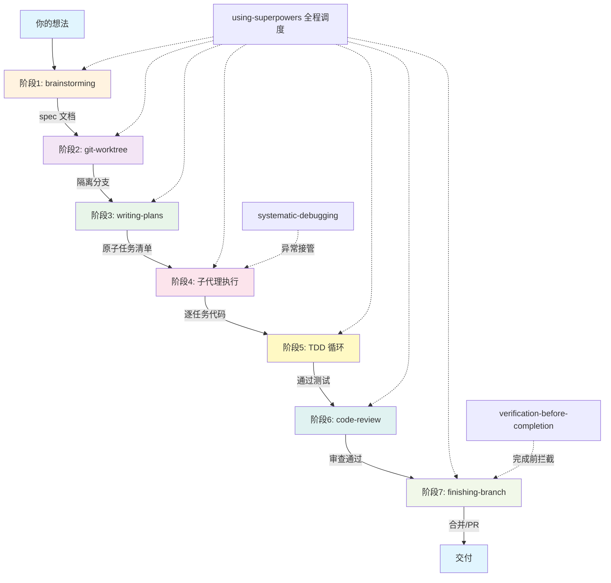

# Superpowers 独立章节 实施计划

> **For agentic workers:** REQUIRED SUB-SKILL: Use superpowers:subagent-driven-development (recommended) or superpowers:executing-plans to implement this plan task-by-task. Steps use checkbox (`- [ ]`) syntax for tracking.

**Goal:** 将 Superpowers 从现有第2章的一个小节独立为完整一章（新文件），同时替换第2章原有 1.3 节为简要概述。

**Architecture:** 新建 `docs/aillm/Claude/03-第3章 Superpowers深度实战.md`，修改 `docs/aillm/Claude/02-第2章 Skills与生态.md` 的 1.3 节。侧边栏通过 `auto-gen-sidebar.js` 自动生成，无需手动配置。

**Tech Stack:** Markdown + VitePress（Mermaid 图表）

---

### Task 1: 创建章头 + X.1 概述与哲学

**Files:**
- Create: `docs/aillm/Claude/03-第3章 Superpowers深度实战.md`

- [ ] **Step 1: 写入章头与 X.1**

```markdown
# Superpowers 深度实战

## 1.1 概述与哲学

### 1.1.1 是什么

Superpowers 是 AI 编程代理的"工作规范框架"——不是让 AI 更聪明，而是**让 AI 更守规矩**。

打个比方：AI 编程代理就像一个刚毕业的程序员，技术能力有，但缺乏经验。让它干活，可能做得很快，但质量参差不齐。Superpowers 就是给这个程序员配了一个"老师傅"——每做一步都要汇报，老师傅点头了才能继续。

### 1.1.2 核心理念

Superpowers 的设计哲学只有一句话：**把 AI 当作热情但没判断力的初级工程师**。用强制流程约束行为，而不是靠"建议"。

四大原则：

| 原则 | 含义 |
|------|------|
| **TDD 先行** | 先写测试，再写代码，不写测试的代码会被删掉 |
| **系统化而非临时应对** | 每个阶段有明确的输入、输出、门禁条件 |
| **降低复杂度** | 大任务拆成 2-5 分钟的小任务，每个任务独立验证 |
| **证据而非声称** | 宣称"完成"之前，必须拿出测试通过的证据 |

### 1.1.3 背景与影响力

由 **Jesse Vincent**（知名开源项目 RT 的作者）创建。他在用 Claude Code 开发时发现 AI 经常会"自作聪明"跳过重要步骤，于是开发了这套技能系统，把最佳实践变成"硬规则"。

截至 2026 年，GitHub **51,000+ Stars**，**16+ 位贡献者**，**570,000+ 安装**。社区贡献了 30 多个额外技能。

### 1.1.4 传统 AI 编程 vs Superpowers

**无 Superpowers**：你的想法 → AI 直接写代码 → 可能漏边界情况、跳过测试、逻辑跑偏

**有 Superpowers**：你的想法 → 层层检查点（追问→计划→TDD→审查→验证）→ 高质量产物

这不是限制 AI，而是保护你的项目。就像开车系安全带，虽然麻烦，但关键时刻能救命。
```

- [ ] **Step 2: Commit**

```bash
git add docs/aillm/Claude/03-第3章 Superpowers深度实战.md
git commit -m "docs: add Superpowers chapter - header and overview"
```

---

### Task 2: X.2 安装与配置

**Files:**
- Modify: `docs/aillm/Claude/03-第3章 Superpowers深度实战.md` (追加)

- [ ] **Step 1: 写入 X.2**

````markdown
## 1.2 安装与配置

### 1.2.1 前置条件

- 已安装 Claude Code（CLI 版本，非 IDE 插件版）
- 基本的命令行操作能力

### 1.2.2 安装

Superpowers 通过插件市场分发。打开 Claude Code，运行：

```bash
# 1. 注册 Superpowers 市场
/plugin marketplace add obra/superpowers-marketplace

# 2. 安装 Superpowers 插件
/plugin install superpowers@superpowers-marketplace
```

安装完成后重启 Claude Code：

```bash
/exit
# 重新进入
claude
```

### 1.2.3 验证安装

试着让 AI 帮你做点什么：

```text
帮我实现一个简单的计算器功能
```

如果你发现 AI **开始问你一堆问题**，而不是直接甩代码——说明 Superpowers 已经在工作了！

示例输出：
```
在开始实现之前，我想先了解一些细节：
1. 这个计算器是命令行工具还是 Web 应用？
2. 需要支持哪些运算？（加减乘除、括号、科学计算？）
3. 数据精度有要求吗？

请回答这些问题，我会据此设计实现方案。
```

如果 AI 直接写代码了，说明 Superpowers 未被正确触发。检查 `/plugin list` 确认插件状态。

### 1.2.4 自动触发机制

Superpowers 通过 `using-superpowers` 核心调度器自动检测任务类型并触发对应流程：

- 检测到"设计/讨论"关键词 → 触发 `brainstorming`
- 检测到"写代码/实现" → 触发 `test-driven-development`
- 检测到"修 bug" → 触发 `systematic-debugging`
- 宣称"完成" → 触发 `verification-before-completion`

也可以手动引导：

```text
"用 superpowers 的 brainstorming 帮我梳理这个需求"
"用 TDD 方式实现这个函数"
```

### 1.2.5 禁用特定技能

不是所有任务都需要完整流程。在项目根目录创建 `.superpowers/config.json`：

```json
{
  "disabledSkills": [
    "using-git-worktrees"
  ]
}
```

这样 Git Worktree 技能就会被跳过。简单修改（改文案、修样式、加日志）可以告诉 AI："这个小修改，使用简化流程"。
````

- [ ] **Step 2: Commit**

```bash
git add docs/aillm/Claude/03-第3章 Superpowers深度实战.md
git commit -m "docs: add Superpowers chapter - installation and setup"
```

---

### Task 3: X.3 14 个技能全貌

**Files:**
- Modify: `docs/aillm/Claude/03-第3章 Superpowers深度实战.md` (追加)

- [ ] **Step 1: 写入 X.3**

```markdown
## 1.3 14 个技能全貌

Superpowers 的 14 个技能按 **7 步流水线** 组织。每个技能有明确的触发场景和星标评级。

**评星维度**：流程必需度——去掉该技能，Superpowers 的开发闭环是否断裂。同时综合考量自动触发可靠性和执行质量。

### 1.3.1 技能总览（按流水线维度）

| 流水线阶段 | 技能 | 必需度 | 触发场景 | 一句话职责 |
|-----------|------|--------|----------|-----------|
| **阶段一：头脑风暴** | `brainstorming` | ★★★★ | "帮我设计一个..." | 苏格拉底式追问，把模糊想法变成清晰 spec |
| **阶段二：Git Worktree** | `using-git-worktrees` | ★★ | 需要并行开发 | 自动创建隔离分支，不污染主工作区 |
| **阶段三：编写计划** | `writing-plans` | ★★★★★ | "制定实施计划" | 拆成 2-5 分钟可完成的原子任务 |
| **阶段四：子代理执行** | `executing-plans` | ★★★★ | 批量执行任务 | 逐个执行，每步 checkpoint 验证 |
| | `subagent-driven-development` | ★★★ | 复杂多文件改动 | 每任务独立子代理 + 两阶段审查 |
| | `dispatching-parallel-agents` | ★★★ | 多个独立任务 | 自动检测可并行任务，派发子代理 |
| **阶段五：TDD** | `test-driven-development` | ★★★★★ | "写代码实现..." | 强制 Red → Green → Refactor |
| **阶段六：代码审查** | `requesting-code-review` | ★★★★ | 代码完成后 | 5 个子代理并行审查（安全/性能/正确性/风格/测试） |
| | `receiving-code-review` | ★★★ | 收到审查反馈 | 结构化处理，逐条修复 |
| **阶段七：分支完成** | `finishing-a-development-branch` | ★★★ | 功能开发完成 | 4 种选项：合并/PR/保留/丢弃 |
| **贯穿全局** | `using-superpowers` | ★★★★★ | 全局 | 核心调度器，确保流程约束生效 |
| | `systematic-debugging` | ★★★★★ | "修这个 bug" | 观察→假设→验证→修复 四阶段 |
| | `verification-before-completion` | ★★★★ | 宣称"完成"前 | 检查是否真的完成，拿出证据 |
| | `writing-skills` | ★★ | "创建一个新 skill" | 元技能，用 TDD 方式编写新 Skill |

### 1.3.2 星标解读

| 星标 | 含义 | 示例 |
|------|------|------|
| ★★★★★ | 流程支柱，去掉后闭环断裂 | `test-driven-development`、`writing-plans`、`systematic-debugging`、`using-superpowers` |
| ★★★★ | 高价值补充，显著提升质量 | `brainstorming`、`executing-plans`、`requesting-code-review`、`verification-before-completion` |
| ★★★ | 特定场景有价值 | `subagent-driven-development`、`dispatching-parallel-agents`、`receiving-code-review`、`finishing-a-development-branch` |
| ★★ | 低频但有用 | `using-git-worktrees`、`writing-skills` |
```

- [ ] **Step 2: Commit**

```bash
git add docs/aillm/Claude/03-第3章 Superpowers深度实战.md
git commit -m "docs: add Superpowers chapter - 14 skills overview"
```

---

### Task 4: X.4 7 步核心流水线

**Files:**
- Modify: `docs/aillm/Claude/03-第3章 Superpowers深度实战.md` (追加)

- [ ] **Step 1: 写入 X.4 流水线图 + 逐阶段详解**

````markdown
## 1.4 7 步核心流水线

Superpowers 把软件开发拆成 7 个阶段，每个阶段有明确的**触发时机、输入产物、输出产物、门禁条件**。

### 1.4.1 流水线全景



### 1.4.2 逐阶段详解

#### 阶段一：头脑风暴（Brainstorming）

| 维度 | 说明 |
|------|------|
| **触发时机** | 用户输入包含"设计/创建/新增/开发"等关键词 |
| **涉及技能** | `brainstorming` |
| **输入** | 用户的模糊需求 |
| **输出** | 设计文档（`docs/superpowers/specs/`） |
| **门禁条件** | 用户明确批准设计后，才能进入下一阶段 |

这是 Superpowers **最有价值的关卡**。AI 不会直接动手，而是：

1. 探索项目上下文（README、配置文件、Git 历史）
2. 逐个澄清问题（一次只问一个）
3. 提出 2-3 个可行方案，说明优缺点
4. 把讨论结果整理成设计文档

**硬性规定**：在用户批准设计之前，**禁止写任何代码**。

#### 阶段二：Git Worktree（环境隔离）

| 维度 | 说明 |
|------|------|
| **触发时机** | 设计确认后，或需要并行开发时 |
| **涉及技能** | `using-git-worktrees` |
| **输入** | 当前分支 |
| **输出** | 隔离的 worktree 工作目录 |
| **门禁条件** | worktree 创建成功，分支干净 |

简单任务自动跳过此阶段。复杂任务或需要并行开发时，为每个功能创建独立工作目录。

#### 阶段三：编写计划（Writing Plans）

| 维度 | 说明 |
|------|------|
| **触发时机** | 设计确认后，或用户说"制定计划" |
| **涉及技能** | `writing-plans` |
| **输入** | 设计文档 |
| **输出** | 原子任务清单（`docs/superpowers/plans/`） |
| **门禁条件** | 每个任务 2-5 分钟可完成，包含确切文件路径和验证步骤 |

把大功能拆成 2-5 分钟的原子任务。每个任务包含：确切文件路径、完整代码、验证命令。

#### 阶段四：子代理执行（Subagent Development）

| 维度 | 说明 |
|------|------|
| **触发时机** | 计划就绪后执行 |
| **涉及技能** | `executing-plans`、`subagent-driven-development`、`dispatching-parallel-agents` |
| **输入** | 原子任务清单 |
| **输出** | 代码 + 测试 |
| **门禁条件** | 每个任务完成后 checkpoint 验证 |

三种执行模式：

- **`executing-plans`**：逐个执行，每步验证
- **`subagent-driven-development`**：每个任务派发独立子代理，两阶段审查（规格合规 + 代码质量）
- **`dispatching-parallel-agents`**：自动检测可并行任务，同时派发多个子代理

#### 阶段五：TDD 循环

| 维度 | 说明 |
|------|------|
| **触发时机** | 检测到"写代码/实现"操作时自动触发 |
| **涉及技能** | `test-driven-development` |
| **输入** | 每个子任务的实现需求 |
| **输出** | 通过测试的代码 |
| **门禁条件** | Red → Green → Refactor 完整循环 |

严格的 RED-GREEN-REFACTOR 循环：

1. **RED** — 写一个会失败的测试
2. **验证** — 运行测试，确认它真的失败了
3. **GREEN** — 写最少的代码让测试通过
4. **验证** — 运行测试，确认通过
5. **REFACTOR** — 重构代码，保持测试通过

**铁律**：如果写了代码但没有先写测试，删掉代码，重新开始。

#### 阶段六：代码审查（Code Review）

| 维度 | 说明 |
|------|------|
| **触发时机** | 所有任务完成后自动触发 |
| **涉及技能** | `requesting-code-review`、`receiving-code-review` |
| **输入** | 完成的代码 |
| **输出** | 审查报告（规格合规 + 代码质量） |
| **门禁条件** | 无严重问题（Critical/High） |

两维度审查：

- **规格合规**：是否完全符合设计文档？有没有遗漏或额外添加的功能？
- **代码质量**：命名规范、测试覆盖率、重复代码、性能问题、安全风险

5 个子代理并行审查（安全、性能、正确性、风格、测试）。

#### 阶段七：分支完成（Finishing Branch）

| 维度 | 说明 |
|------|------|
| **触发时机** | 所有任务完成且审查通过 |
| **涉及技能** | `finishing-a-development-branch` |
| **输入** | 通过审查的代码 |
| **输出** | 合并或 PR |
| **门禁条件** | `verification-before-completion` 检查通过 |

4 种收尾选项：合并到主分支、创建 PR、保留分支、丢弃分支。

### 1.4.3 横切技能：始终在线

三个贯穿全局的技能不参与阶段调度，但随时可能被触发：

- **`using-superpowers`**：核心调度器，检测任务类型，触发对应阶段
- **`systematic-debugging`**：任何阶段出现异常时接管，四阶段调试（观察→假设→验证→修复）
- **`verification-before-completion`**：任何阶段宣称"完成"前自动检查，确保有证据

### 1.4.4 智能调度

简单任务自动跳过部分阶段，复杂任务走完整流程。比如：

- 改个文案 → 可能直接跳过 brainstorming 和 git-worktree
- 加个完整功能 → 7 步全走
- 修个 Bug → `systematic-debugging` 直接接管，不走 brainstorming
````

- [ ] **Step 2: Commit**

```bash
git add docs/aillm/Claude/03-第3章 Superpowers深度实战.md
git commit -m "docs: add Superpowers chapter - 7-step pipeline"
```

---

### Task 5: X.5 实战演练：待办事项功能

**Files:**
- Modify: `docs/aillm/Claude/03-第3章 Superpowers深度实战.md` (追加)

- [ ] **Step 1: 写入 X.5 实战场景与步骤 1-2**

````markdown
## 1.5 实战演练：从零开发待办事项功能

本节以 Node.js + Express 项目为例，完整走通 Superpowers 7 步流水线——从提出需求到最终提交。

**场景设定**：你有一个 Express + SQLite 项目，需要添加"待办事项"功能，支持增删改查。

### 步骤 1：提出需求

在 Claude Code 里输入：

```text
我想在项目里加一个待办事项功能，用户可以添加、删除、标记完成
```

### 步骤 2：头脑风暴阶段

Superpowers 检测到"加一个功能"后，`brainstorming` 自动接管。AI 先探索项目上下文，然后开始追问：

```text
AI: 我注意到你的项目使用了 Express 框架和 SQLite 数据库。
    在设计待办事项功能之前，我想确认几个问题：

    Q1: 待办事项需要哪些字段？
        A) 只要标题和完成状态
        B) 标题 + 描述 + 截止日期 + 优先级

你还是: A，先保持简单，只需要标题和完成状态

AI: Q2: 是否需要分类或标签功能？

你还是: 暂不需要

AI: Q3: 用户认证呢？单用户还是多用户？

你还是: 暂时单用户，不需要认证

AI: 明白了。还有几个细节：

    Q4: 删除是物理删除还是软删除（标记为已删除）？

你还是: 物理删除就行

AI: Q5: 标题有长度限制吗？

你还是: 最长 200 字符

AI: Q6: 需要支持批量操作吗（批量删除、批量标记完成）？

你还是: 不需要，先做基本 CRUD
```

这样的问答会持续到需求足够清晰。
````

- [ ] **Step 2: 写入步骤 3：确认设计文档**

````markdown
### 步骤 3：确认设计文档

问答结束后，AI 生成设计文档：

```markdown
## 待办事项功能设计文档

### 数据模型

| 字段 | 类型 | 说明 |
|------|------|------|
| id | INTEGER | 主键，自增 |
| title | TEXT | 待办标题，最长 200 字符 |
| completed | BOOLEAN | 完成状态，默认 false |
| created_at | DATETIME | 创建时间 |
| updated_at | DATETIME | 更新时间 |

### API 设计

| 方法 | 路径 | 说明 |
|------|------|------|
| POST | /api/todos | 创建待办 |
| GET | /api/todos | 获取待办列表 |
| GET | /api/todos/:id | 获取单个待办 |
| PUT | /api/todos/:id | 更新待办 |
| DELETE | /api/todos/:id | 删除待办 |

### 文件结构

- routes/todos.js — 路由定义
- controllers/todoController.js — 业务逻辑
- models/todo.js — 数据模型
- tests/todos.test.js — 测试用例
- docs/todos-api.md — API 文档

请确认是否按此方案实施？
```

你需要明确回复"确认"或提出修改意见。
````

- [ ] **Step 3: 写入步骤 4：TDD 测试先行**

````markdown
### 步骤 4：TDD 测试先行

确认设计后，`test-driven-development` 接管。AI **先写测试**，而非实现代码：

```javascript
// tests/todos.test.js
const request = require('supertest');
const app = require('../app');

describe('Todo API', () => {
  beforeEach(async () => {
    await db.run('DELETE FROM todos');
  });

  describe('POST /api/todos', () => {
    test('应该创建新的待办事项', async () => {
      const response = await request(app)
        .post('/api/todos')
        .send({ title: '学习 Superpowers' });

      expect(response.status).toBe(201);
      expect(response.body.title).toBe('学习 Superpowers');
      expect(response.body.completed).toBe(false);
    });

    test('标题为空时应该返回错误', async () => {
      const response = await request(app)
        .post('/api/todos')
        .send({ title: '' });

      expect(response.status).toBe(400);
      expect(response.body.error).toBeDefined();
    });

    test('标题超长时应该返回错误', async () => {
      const longTitle = 'a'.repeat(201);
      const response = await request(app)
        .post('/api/todos')
        .send({ title: longTitle });

      expect(response.status).toBe(400);
    });
  });

  describe('GET /api/todos', () => {
    test('应该返回待办列表', async () => {
      // 先创建几个待办...
      const response = await request(app).get('/api/todos');
      expect(response.status).toBe(200);
      expect(Array.isArray(response.body)).toBe(true);
    });
  });

  // DELETE、PUT 等更多测试用例...
});
```

AI 运行这些测试，**确认全部失败**：

```bash
$ npm test -- tests/todos.test.js

FAIL  tests/todos.test.js
  Todo API
    POST /api/todos
      ✕ 应该创建新的待办事项
      ✕ 标题为空时应该返回错误
      ✕ 标题超长时应该返回错误
    GET /api/todos
      ✕ 应该返回待办列表

Tests: 4 failed, 0 passed
```

这一步至关重要——确保测试真的能检测问题。有时候测试写错了会意外通过，Superpowers 会强制确认每个测试的预期结果。
````

- [ ] **Step 4: 写入步骤 5：实现代码**

````markdown
### 步骤 5：实现功能

测试确认全部失败后，AI 才开始写实现代码。**每完成一个方法就跑对应测试**，通过后才继续：

```javascript
// models/todo.js
const db = require('../db');

class Todo {
  static async create(title) {
    if (!title || title.trim() === '') {
      throw new Error('标题不能为空');
    }
    if (title.length > 200) {
      throw new Error('标题不能超过200个字符');
    }

    const result = await db.run(
      `INSERT INTO todos (title, completed, created_at, updated_at)
       VALUES (?, ?, datetime('now'), datetime('now'))`,
      [title.trim(), false]
    );

    return this.findById(result.lastID);
  }

  static async findById(id) {
    const row = await db.get(
      'SELECT * FROM todos WHERE id = ?',
      [id]
    );
    return row || null;
  }

  static async findAll() {
    return await db.all(
      'SELECT * FROM todos ORDER BY created_at DESC'
    );
  }

  static async update(id, { title, completed }) {
    const todo = await this.findById(id);
    if (!todo) throw new Error('待办不存在');

    await db.run(
      `UPDATE todos
       SET title = ?, completed = ?, updated_at = datetime('now')
       WHERE id = ?`,
      [
        title !== undefined ? title : todo.title,
        completed !== undefined ? completed : todo.completed,
        id
      ]
    );

    return this.findById(id);
  }

  static async delete(id) {
    const todo = await this.findById(id);
    if (!todo) throw new Error('待办不存在');

    await db.run('DELETE FROM todos WHERE id = ?', [id]);
    return { deleted: true };
  }
}

module.exports = Todo;
```

每完成一个方法，运行对应测试：

```bash
$ npm test -- tests/todos.test.js

PASS  tests/todos.test.js
  Todo API
    POST /api/todos
      ✓ 应该创建新的待办事项
      ✓ 标题为空时应该返回错误
      ✓ 标题超长时应该返回错误
    GET /api/todos
      ✓ 应该返回待办列表

Tests: 4 passed, 0 failed
```
````

- [ ] **Step 5: 写入步骤 6-7：代码审查与提交**

````markdown
### 步骤 6：代码审查

所有功能完成后，`requesting-code-review` 自动触发。AI 生成审查报告：

```markdown
## 代码审查报告

### 规格合规检查 ✅

- [x] POST /api/todos 实现完整
- [x] GET /api/todos 实现完整
- [x] PUT /api/todos/:id 实现完整
- [x] DELETE /api/todos/:id 实现完整
- [x] 未添加设计文档以外的功能

### 代码质量检查

- [x] 命名规范一致
- [x] 错误处理完善
- [x] SQL 使用参数化查询，无注入风险
- [x] 测试覆盖率 92%

### 建议（非阻塞）

1. 可以添加日志记录，方便调试
2. 考虑添加分页功能（后续版本）

审查结果：通过 ✅
```

### 步骤 7：完成提交

审查通过后，`verification-before-completion` 做最终检查——所有测试通过、审查无严重问题、无遗漏功能。然后提交：

```bash
git add .
git commit -m "feat: add todo API with TDD

- Add todo model with CRUD operations
- Add API routes for todo management
- Add comprehensive test cases (92% coverage)
- Add API documentation

Co-authored-by: Claude <claude@anthropic.com>"
```

---

**7 步走完。** 虽然比"直接让 AI 写代码"慢一些，但产出物质量高得多——有完整的测试、API 文档和审查记录，后期维护成本大大降低。
````

- [ ] **Step 6: Commit**

```bash
git add docs/aillm/Claude/03-第3章 Superpowers深度实战.md
git commit -m "docs: add Superpowers chapter - hands-on todo demo"
```

---

### Task 6: X.6 优点与不足

**Files:**
- Modify: `docs/aillm/Claude/03-第3章 Superpowers深度实战.md` (追加)

- [ ] **Step 1: 写入 X.6**

```markdown
## 1.6 优点与不足

### 优点

| 优点 | 说明 |
|------|------|
| **代码质量大幅提升** | TDD 强制 + 两阶段审查，测试覆盖率通常 90%+，bug 显著减少 |
| **设计文档沉淀** | 每次开发都产出 spec 文档，后期维护有据可查，新人接手也容易 |
| **流程标准化** | 无论谁开发，产出物质量一致。团队成员遵循相同规范 |
| **可扩展性** | 可以定制自己的技能，适应不同项目的需求（如团队代码规范检查） |
| **减少 AI "自作聪明"** | 不会出现"AI 猜错了需求闷头写一堆代码"的情况 |

用了一个月后的真实数据（来源：微信文章作者）：

- 单个功能开发时间增加约 **30%**
- 但整体项目交付时间缩短约 **20%**（因为返工大幅减少）

### 不足

| 不足 | 说明 |
|------|------|
| **初期速度慢** | 以前 5 分钟出代码，现在要 20 分钟。需要适应期 |
| **不适合快速原型** | 只是想验证一个想法、写个一次性脚本？用 Superpowers 是过度工程 |
| **Token 消耗大** | 每个阶段都需上下文，14 个技能的 SKILL.md 也会占用系统提示词 |
| **学习曲线** | 需要理解 7 步流程、自动触发机制、何时可以跳过某些阶段 |
| **限制工具** | 目前仅支持 Claude Code、Codex CLI、OpenCode；Cursor/Windsurf 等 IDE 内置 AI 不兼容 |

### 适用场景速查

| 适合 | 不太适合 |
|------|----------|
| 日常功能开发 | 快速原型验证 |
| 团队协作项目 | 简单一次性脚本 |
| 对代码质量有要求的项目 | 只想快速试试想法 |
| 需要标准化流程的团队 | 不想改变现有工作流的场景 |
```

- [ ] **Step 2: Commit**

```bash
git add docs/aillm/Claude/03-第3章 Superpowers深度实战.md
git commit -m "docs: add Superpowers chapter - pros and cons"
```

---

### Task 7: 替换第 2 章原有 1.3 节

**Files:**
- Modify: `docs/aillm/Claude/02-第2章 Skills与生态.md:64-117`

- [ ] **Step 1: 删除旧 1.3 节（第 64-117 行），写入简要概述 + 链接**

将现有第 64-117 行（整个 `### 1.3 Superpowers 实战` 节）替换为：

```markdown
### 1.3 Superpowers

Superpowers 是目前最完整的开发流程技能包，51k+ Stars、570k+ 安装，14 个技能覆盖 7 步流水线（头脑风暴 → Git Worktree → 编写计划 → 子代理执行 → TDD → 代码审查 → 分支完成）。

详见 **[第3章 Superpowers 深度实战](../Claude/03-第3章%20Superpowers深度实战.md)**。
```

- [ ] **Step 2: 同步修正 1.1 套装对比表中 Superpowers 的安装命令**

将第 10 行的旧安装命令：
```
| **[Superpowers](https://github.com/obra/superpowers)** | 195k+ | 工程纪律 + TDD 强制 | 14 个 | 日常开发的完整闭环 | `npx skills add obra/superpowers -g -a claude-code` |
```

替换为 plugin 方式：
```
| **[Superpowers](https://github.com/obra/superpowers)** | 51k+ | 工程纪律 + TDD 强制 | 14 个 | 日常开发的完整闭环 | `/plugin install superpowers@superpowers-marketplace` |
```

- [ ] **Step 3: Commit**

```bash
git add docs/aillm/Claude/02-第2章 Skills与生态.md
git commit -m "docs: replace Superpowers 1.3 section with link to new chapter"
```

---

## Self-Review

**1. Spec coverage:** 每个 spec 节对应一个 Task：
- X.1 → Task 1
- X.2 → Task 2
- X.3 → Task 3
- X.4 → Task 4
- X.5 → Task 5
- X.6 → Task 6
- 对现有文档的影响 → Task 7

**2. Placeholder scan:** 无 TBD/TODO/占位符。所有内容均为完整 Markdown。

**3. Type consistency:** 文件路径使用 `docs/aillm/Claude/03-第3章 Superpowers深度实战.md`，跨所有 Task 一致。星标、技能名称与设计文档一致。安装命令使用 plugin 方式，与设计文档一致。
